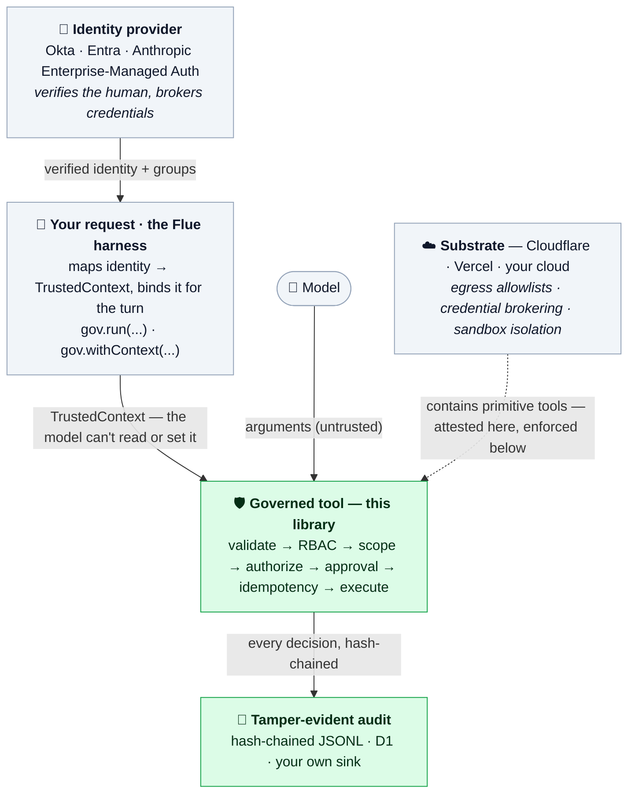
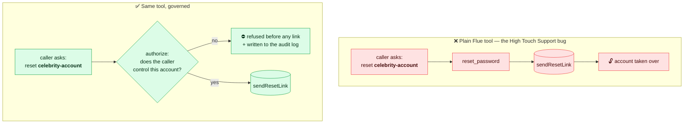

# flue-governed-tools

In-process governance for [Flue](https://github.com/withastro/flue) tools: stop
an agent from taking an action it isn't allowed to — on the wrong account, or
twice — and keep a tamper-evident receipt of every one it does.

---

## A real example, because we just got one

In spring 2026, attackers took over more than 20,000 Instagram accounts without
breaking into anything. They asked.

Meta had an AI support agent called High Touch Support that helped locked-out
users get back into their accounts. One of its tools could trigger a password
reset. The tool worked. The problem was what it didn't do: it never checked that
the person asking actually owned the account they were asking about. So you
could point it at someone else's account, get a reset link, and walk in. Even
accounts without 2FA. The campaign ran for about seven weeks before anyone
noticed, and the list of victims included a White House handle and a senior US
Space Force account.

(Reporting: [BleepingComputer](https://www.bleepingcomputer.com/news/security/meta-ai-support-data-breach-affects-20-000-instagram-accounts/),
[TechCrunch](https://techcrunch.com/2026/06/01/hackers-hijacked-instagram-accounts-by-tricking-meta-ai-support-chatbot-into-granting-access/),
[SecurityWeek](https://www.securityweek.com/meta-says-20000-instagram-accounts-hacked-via-ai-tool-abuse/).)

The model wasn't jailbroken. There was no clever prompt injection. The agent did
a normal thing it was allowed to do, and the only thing standing between "help a
user" and "hand over 20,000 accounts" was a check that lived nowhere. Not in the
prompt, because prompts aren't security. It needed to live at the exact spot
where the tool does the dangerous part: *is the person asking allowed to touch
this account?*

That check is the whole reason this library exists.

## Where this fits with Flue

Flue gives you a real agent harness: sandboxing, sessions, MCP, tools, the works.
It can already say "this tool is only callable when the agent is in this state."
That's useful, and it's not what bit Meta.

The questions that bit Meta are different. "Is this caller allowed to act on
*this* account?" "Did we already do this once, so don't do it again on a retry?"
"Can we hand finance a log of every account change and show it hasn't been
touched?" Those aren't questions about harness state. They're questions about
the specific call, the specific caller, and the specific record. They belong
right next to the tool, and that's where this library puts them.

Short version: Flue decides what the agent can do. This decides who it's allowed
to do it to, whether it's safe to do twice, and whether you can prove what it
did.

## How it fits together

The pieces stack. Identity is established once, up top, by something that already
knows who the human is; it flows down into the trusted context, and every tool
call is decided against it.



The two green boxes are what this library owns: the per-call decision and the
record of it. Everything around them — the identity above, the substrate
below — is the platform's job. Notably, the **substrate** is what actually
*contains* a "primitive" tool (egress allowlists, credential brokering,
isolation); this library attests to that containment and flags it (see below),
but doesn't enforce it.

**Identity comes from the harness, never the model.** The top box is not part of
this library, and that's the point. Whatever already authenticates your
users — Okta or Entra groups, or Anthropic's Enterprise-Managed Auth provisioning
the connection through your IdP — is the source of truth for *who the caller is*.
You map its verified claims into the trusted context once, at the start of the
turn, and the model never gets a say in it:

```ts
// Map your IdP's verified claims into the trusted context. None of this
// comes from the conversation — the model can't read it and can't set it.
await gov.run(
  {
    actor: {
      id: session.user.sub,         // verified subject
      roles: session.user.groups,   // Okta / Entra groups → roles
    },
    tenantId: session.org.id,
    scopes: session.entitlements,    // coarse grants the IdP already knows
  },
  () => harness.prompt(userMessage),
);
```

An IdP gives you coarse identity: *this person is in the `account_admin` group*.
That maps straight onto RBAC — `requireRoles: ["account_admin"]` checks a group
before the tool runs. What an IdP group *can't* express is the per-call question
that bit Meta: "does this admin control *this specific account*?" That's the
authorization and the audit this library adds on top of the identity the harness
already established — the part the IdP can't see and the model shouldn't decide.

## The fix is a wrapper

The same tool, before and after — the only thing that changes is that the
ownership check now *exists* and runs before the side effect:



Here's a support tool on plain Flue. It resets a password:

```ts
import { createAgent, defineTool } from "@flue/runtime";
import * as v from "valibot";

const resetPassword = defineTool({
  name: "reset_password",
  description: "Send a password reset link for an account.",
  parameters: v.object({ accountId: v.string() }),
  execute: async (a) => {
    await accounts.sendResetLink(a.accountId);
    return `Sent a reset link for ${a.accountId}.`;
  },
});

const agent = createAgent(() => ({ model, tools: [resetPassword] }));
```

This is the High Touch Support bug in miniature. Nothing checks that the caller
is allowed to reset *that* account.

Two things change the moment you wrap it with this library.

First, the tool above won't even define. A `sideEffect: true` tool with no
authorization gate throws a `GovernanceConfigError` at startup and tells you to
add one. The exact HTS failure — a dangerous tool with the check living nowhere
— isn't something you can ship by accident.

Second, here's where the check goes. For account recovery the honest gate is
"does the caller actually control this account," which a static list can't
capture, so it lives in `authorize`:

```ts
import { createAgent, defineTool } from "@flue/runtime";
import * as v from "valibot";
import { createGovernedToolkit, caller } from "flue-governed-tools";

const gov = createGovernedToolkit({
  audit: "audit.jsonl",   // a path → hash-chained JSONL (or pass your own AuditLog)
  defineTool,             // inject Flue's defineTool once
});                       // built-in context store + in-memory idempotency by default

const resetPassword = gov.tool({                      // one call → a Flue ToolDefinition
  name: "reset_password",
  description: "Send a password reset link for an account.",
  parameters: v.object({ accountId: v.string() }),
  sideEffect: true,

  // The check HTS never made: does this caller actually control the account?
  // `caller(...)` keys the decision to the authenticated caller (a declared
  // anchor, so it can't be "arg vs nothing"); `a` is inferred from `parameters`.
  // Runs before any link is sent; a false answer logs the refusal.
  authorize: caller((a, ctx) => accounts.isControlledBy(a.accountId, ctx.actor.id)),

  // A retry won't send a second reset link.
  idempotency: { key: (a) => `reset:${a.accountId}` },

  execute: async (a) => {
    await accounts.sendResetLink(a.accountId);
    return `Sent a reset link for ${a.accountId}.`;
  },
});

const agent = createAgent(() => ({ model, tools: [resetPassword] }));
```

The caller's identity comes from your own auth, never the model. You set it once
for the conversation with `gov.run` (reading actor/tenant off `FlueContext`'s
request). No `scopes` here — this tool gates with `authorize`; add them only for
tools that use `scope`.

```ts
await gov.run(
  { actor: { id: "user-7", roles: ["account_holder"] }, tenantId: "app" },
  () => harness.prompt("I'm locked out, can you reset my password?"),
);
```

Now a request to reset someone else's account is refused before `sendResetLink`
runs, and the refusal lands in the audit log. The library doesn't write
`isControlledBy` for you — that ownership check is your business logic, and it's
the part HTS got wrong. What it guarantees is that the check exists, runs every
time before the side effect, and can't be quietly dropped.

## The one idea to take away

The model controls the arguments. You control the context.

The `accountId` in the call comes from the model, which means it can be anything
the conversation talked it into. Treat it as a claim, not a fact. The trusted
context — who the caller is, which accounts they've proven they own — comes from
your authenticated request and travels separately, through `ContextStore`
(`AsyncLocalStorage`). The model can't read it and can't set it.

`scope(args, ctx)` is where those two meet, and it's deliberately the safe
shape: you say what the call *wants to touch*, the library compares it to what
the **caller** is allowed to touch. You never write the comparison, so you can't
forget to involve the caller — the mistake that defeats a check from the inside,
where `accountExists(a.target)` passes the very injection it should stop and the
attack succeeds *through* the check.

When you need a dynamic check `scope` can't express, `authorize` is keyed to a
**declared anchor** so "compare an arg to nothing" has no shape to write:

```ts
// caller identity (the common case) — `a` inferred, no annotation
authorize: caller((a, ctx) => owns(ctx.actor.id, a.target))

// a trusted server-side record — for anonymous recovery, where there's no
// authenticated caller. The named source is resolved before `check` runs; you
// compare the untrusted arg to the trusted value.
authorize: trusted("accountEmail", (a, email) => a.resetEmail === email)
```

Register sources once: `createGovernedToolkit({ trustedSources: { accountEmail } })`.
The anchor is also what the governance manifest records, so a reviewer can see
*every* side-effecting tool is keyed to caller or a trusted source — never to an
argument alone.

## Scoped tools vs general primitives

Not every tool can be governed by argument scoping. A `reset_password(accountId)`
has a real *target* you can check against the caller. A `run_sql(query)`, a
shell tool, or a generic `http_request(url, body)` doesn't — the argument *is*
free-form code, and no in-process check can bind what the model writes into it.

So tools are classified by `kind`:

- **`"scoped"`** (default): structured args, a real target → fully governed
  in-process by `scope`/`authorize`.
- **`"primitive"`**: free-form payload. A side-effecting primitive **won't
  define** unless you set `egressControlled: true`, your attestation that its
  blast radius is bounded *out-of-band* (egress allowlist, no in-sandbox
  credential, DB-level controls). Primitives are flagged as **broad** in the
  audit so a reviewer sees them.

```ts
toolkit.tool({
  name: "run_sql",
  description: "Run a read query.",
  parameters: v.object({ query: v.string() }),
  sideEffect: true,
  kind: "primitive",
  egressControlled: true,   // YOUR attestation: bounded by a read-replica + egress allowlist
  execute: (a, c) => db.run(c.tenantId, a.query),
});
```

Be clear about what this is and isn't. The library **does not verify or enforce**
that containment — `egressControlled` is a developer attestation, not a control
it can check (that containment lives in the substrate: egress, DB, the absent
credential). Its only two jobs for a primitive are honest ones it *can* back:
**refuse to silently certify** a broad, credentialed tool as "governed," and
**flag it broad in the audit**. Enforcing the containment is the substrate's job
(Cloudflare egress, DB row-security); this just stops a primitive from
masquerading as governed and makes its breadth visible.

## Binding context: two patterns

How the trusted context reaches the tool depends on how Flue runs the tool.

**You drive the prompt (workflows, direct calls).** When your code holds the
session and `await`s `session.prompt(...)`, the tool runs inside your async call,
so `ContextStore` (AsyncLocalStorage) carries the context straight through —
that's the quickstart above.

**Flue drives the prompt (dispatched / addressable agents).** With `dispatch()`,
Flue processes the turn on its own, detached from your caller, so an
`AsyncLocalStorage` set around `dispatch()` won't reach the tool. Bind the
context per invocation instead, inside `createAgent`, where you have the
payload:

```ts
const agent = createAgent((ctx) => {
  // ctx.payload / ctx.env came from your authenticated dispatch entrypoint.
  const trusted = deriveTrustedContext(ctx.payload, ctx.env);
  const bound = toolkit.withContext(trusted); // shares audit/idempotency/etc.

  return {
    model,
    tools: [bound.tool({ name: "reset_password", /* … */ })],
  };
});
```

`withContext` returns a toolkit that resolves the context from that fixed value
(or a resolver you pass), so the bound tool doesn't depend on ambient state.
Same audit log, same idempotency store, per-invocation identity.

## What runs on every call

```
context → validate → RBAC → scope → authorize → approval → idempotency
        → execute → audit
```

Any step can stop the call — allowed or refused, succeeded, replayed, or
errored. A side-effecting call records an `executing` intent before the handler
runs and the outcome after; everything else writes a single record.

- **Scope** keeps a call to one account or one tenant, and keeps callers off
  accounts that aren't theirs.
- **Authorize** is the dynamic check a scope list can't express — "does this
  caller actually own this account?" — the gate Meta's HTS was missing.
- **Idempotency** means a retry replays the first result instead of doing the
  thing twice.
- **Audit** is a hash-chained record per call (two for side effects: intent +
  outcome). Edit any past line and `verifyChain()` tells you which one. Add an
  HMAC key and a from-scratch rewrite won't pass either.
- **RBAC**, **approval**, and **PII redaction** are there when you want them, as
  adapters rather than the main story.

## When the defaults aren't enough

Every moving part is an interface with a working in-process default. Swap any of
them without touching a tool:

| Piece | Default | What you'd swap in |
| --- | --- | --- |
| Idempotency | `InMemoryIdempotencyStore` | Redis or Postgres with an atomic claim |
| Audit | `HashChainAuditLog` (JSONL file) | a database, WORM, or object-store sink |
| Approval | none (calls that need it are refused) | Slack, a ticket queue, Flue session state |
| RBAC | any-of role match | OPA or your own permissions service |
| Redaction | regex defaults | OpenRedaction or `@redactpii/node` via `textRedactor` |

Two switches worth knowing:

```ts
// Keyed audit: a full-file rewrite can't forge a valid chain without the key.
new HashChainAuditLog({ path: "audit.jsonl", hmacKey: process.env.AUDIT_KEY });

// Heavier PII redaction without taking on the dependency here:
import { redactString } from "@redactpii/node";
createGovernedToolkit({ redaction: textRedactor((s) => redactString(s)), /* … */ });
```

## Runs wherever Flue runs

No per-runtime matrix to learn. The governance semantics are byte-identical on
Node, Cloudflare Workers, Deno, Bun, Lambda, and edge — hashing is Web Crypto
(the one path everywhere), and context propagation is a *pattern* choice
(`gov.run` where your code drives the prompt, `gov.withContext` where Flue
dispatches it), not a deployment-target choice.

The only thing that varies is **where your records persist** — which is your
storage decision, the same one you'd make for any database, not a runtime
lookup. Take the file default for local/Node, or hand the toolkit a store:

```ts
createGovernedToolkit({ audit: myAuditLog, idempotencyStore: myStore, defineTool });
```

[`examples/cloudflare-adapters.ts`](./examples/cloudflare-adapters.ts) has
copy-pasteable reference stores for Workers — a **D1**-backed `AuditLog` and a
**KV**-backed `IdempotencyStore` (use a **Durable Object** for strict
at-most-once under concurrency). On a runtime without a filesystem you simply
pass a store instead of a path; nothing else changes.

## Human-in-the-loop approval

Real approvals take minutes or hours, so blocking the agent while you wait isn't
an option. The approval adapter handles this by *suspending* instead of
blocking: return `{ pending: true }` and the tool call throws an
`ApprovalPendingError` rather than running. Your harness catches it, pauses the
run (Flue can persist and resume a session), and shows the request to a human.
When they decide, you resume — which re-invokes the tool, the adapter is asked
again, and this time it answers for real.

```ts
const approval = {
  async request(req) {
    // Look up (or open) a ticket for this exact call.
    const ticket = await tickets.findOrCreate(req.tool, req.args, req.ctx);

    if (ticket.state === "approved") return { approved: true, approver: ticket.approver };
    if (ticket.state === "rejected") return { approved: false, reason: ticket.reason };
    return { pending: true, ref: ticket.id }; // still waiting → suspend
  },
};

const toolkit = createGovernedToolkit({ context: ctx.resolver(), audit, approval });
```

```ts
import { isApprovalPending } from "flue-governed-tools";

try {
  await ctx.run(trusted, () => harness.prompt(text));
} catch (err) {
  if (isApprovalPending(err)) {
    // Park the run against err.ref (a ticket id) and return to the user.
    // A webhook from your approval system resumes it later.
    await parkRun(err.ref);
  } else throw err;
}
```

Every governance failure is a typed `GovernanceError` with a `code` from a known
union (`scope_violation`, `authorization_denied`, `approval_pending`, …). Branch
without `instanceof` chains using `isGovernanceError`, `isGovernanceDenial` (a
real refusal the model should be told about), and `isApprovalPending` (the
suspend signal).

Two things make this safe. The pending call writes a `defer`/`pending` line to
the audit log, so a request waiting on a human is on the record, not in limbo.
And because the tool re-runs every check on resume, pairing approval with an
`idempotency` key means the eventual side effect still happens exactly once,
even though the tool was invoked twice.

## See it run

There's a small support-agent example with a mock model, so it runs with no
setup and no API key:

```bash
npm run example
```

It's the same `reset_password` tool from above plus a refund tool, and it walks
through the whole story: defining an ungated side-effect tool is refused;
resetting your own account works but resetting someone else's is blocked (the
Meta case); a duplicate refund replays instead of paying twice; an
over-threshold refund waits for approval; a cross-customer refund is denied; and
the audit chain verifies clean at the end.

For a real Flue run — an actual dispatched agent turn driving the tool through
Flue's runtime, with a faux model instead of a paid one — there's a spike:

```bash
npm run spike
```

It dispatches two turns: the model resets the caller's own account (executes
once, audited), then is talked into resetting someone else's (denied live, the
side effect never runs, and the refusal surfaces to the model as a tool error).

And to *see* "tamper-evident" mean something, open
[`examples/audit-viewer.html`](./examples/audit-viewer.html) in any browser — no
build, no server. Load an `audit.jsonl` (or click **Load sample**), and it
re-verifies the hash chain locally with Web Crypto, the same algorithm the
library writes with. Hit **Tamper with a line** and watch verification point at
the exact `seq` that breaks — the guarantee, demonstrated rather than asserted.

## Is this real yet

It's pre-release, and honest about it. The governance behavior is covered by 90
unit and end-to-end tests, including on-disk tamper detection, the Web Crypto
edge path with D1/KV adapters, and tests that run
a governed tool through the actual `@flue/runtime` `defineTool` and valibot
rather than a stand-in. It has also been run end to end through a real Flue
dispatched agent turn (`npm run spike`) — proving the per-invocation binding and
enforcement work on Flue's detached execution path, and that a denied call comes
back to the model as a tool error. Flue's own API is still in beta (`@flue/runtime`
1.0.0-beta.1), so expect some churn there.

If you want the reasoning instead of just the code:

- [`BUSINESS_REQUIREMENTS.md`](./BUSINESS_REQUIREMENTS.md) — why it exists
- [`FUNCTIONAL_REQUIREMENTS.md`](./FUNCTIONAL_REQUIREMENTS.md) — what it has to do
- [`TECH_ARCHITECTURE.md`](./TECH_ARCHITECTURE.md) — how it's built
- [`TASK_SPECS.md`](./TASK_SPECS.md) — the work, broken down

## License

[MIT](./LICENSE).
